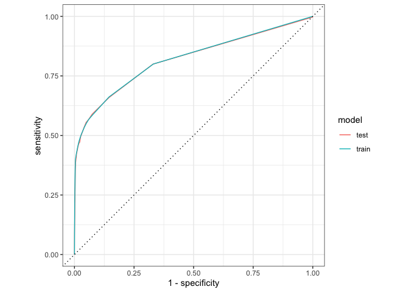

Churn
================
Nicole An
2022-10-25

## Library

``` r
library(tidymodels)
```

    ## ── Attaching packages ────────────────────────────────────── tidymodels 1.0.0 ──

    ## ✔ broom        1.0.1      ✔ recipes      1.0.2 
    ## ✔ dials        1.0.0      ✔ rsample      1.1.0 
    ## ✔ dplyr        1.0.10     ✔ tibble       3.1.8 
    ## ✔ ggplot2      3.3.6      ✔ tidyr        1.2.1 
    ## ✔ infer        1.0.3      ✔ tune         1.0.1 
    ## ✔ modeldata    1.0.1      ✔ workflows    1.1.0 
    ## ✔ parsnip      1.0.2      ✔ workflowsets 1.0.0 
    ## ✔ purrr        0.3.5      ✔ yardstick    1.1.0

    ## ── Conflicts ───────────────────────────────────────── tidymodels_conflicts() ──
    ## ✖ purrr::discard() masks scales::discard()
    ## ✖ dplyr::filter()  masks stats::filter()
    ## ✖ dplyr::lag()     masks stats::lag()
    ## ✖ recipes::step()  masks stats::step()
    ## • Use suppressPackageStartupMessages() to eliminate package startup messages

``` r
library(tidyverse)
```

    ## ── Attaching packages
    ## ───────────────────────────────────────
    ## tidyverse 1.3.2 ──

    ## ✔ readr   2.1.3     ✔ forcats 0.5.2
    ## ✔ stringr 1.4.1     
    ## ── Conflicts ────────────────────────────────────────── tidyverse_conflicts() ──
    ## ✖ readr::col_factor() masks scales::col_factor()
    ## ✖ purrr::discard()    masks scales::discard()
    ## ✖ dplyr::filter()     masks stats::filter()
    ## ✖ stringr::fixed()    masks recipes::fixed()
    ## ✖ dplyr::lag()        masks stats::lag()
    ## ✖ readr::spec()       masks yardstick::spec()

``` r
library(janitor)
```

    ## 
    ## Attaching package: 'janitor'
    ## 
    ## The following objects are masked from 'package:stats':
    ## 
    ##     chisq.test, fisher.test

``` r
library(vip)
```

    ## 
    ## Attaching package: 'vip'
    ## 
    ## The following object is masked from 'package:utils':
    ## 
    ##     vi

``` r
options(yardstick.event_first = FALSE)
```

## Customer Churn

``` r
churn_train <- read_csv("churn_training.csv") %>% clean_names()
```

    ## Rows: 90901 Columns: 34
    ## ── Column specification ────────────────────────────────────────────────────────
    ## Delimiter: ","
    ## chr  (22): email_domain, phone_model, billing_city, billing_postal, billing_...
    ## dbl  (11): monthly_minutes, customer_service_calls, streaming_minutes, total...
    ## date  (1): customer_reg_date
    ## 
    ## ℹ Use `spec()` to retrieve the full column specification for this data.
    ## ℹ Specify the column types or set `show_col_types = FALSE` to quiet this message.

``` r
churn_kaggle <- read_csv("churn_holdout.csv") %>% clean_names()
```

    ## Rows: 10099 Columns: 33
    ## ── Column specification ────────────────────────────────────────────────────────
    ## Delimiter: ","
    ## chr  (22): email_domain, phone_model, billing_city, billing_postal, billing_...
    ## dbl  (10): monthly_minutes, customer_service_calls, streaming_minutes, total...
    ## date  (1): customer_reg_date
    ## 
    ## ℹ Use `spec()` to retrieve the full column specification for this data.
    ## ℹ Specify the column types or set `show_col_types = FALSE` to quiet this message.

``` r
churn_train
```

    ## # A tibble: 90,901 × 34
    ##    monthly_…¹ custo…² strea…³ total…⁴ prev_…⁵ late_…⁶ ip_ad…⁷ phone…⁸ customer…⁹
    ##         <dbl>   <dbl>   <dbl>   <dbl>   <dbl>   <dbl>   <dbl>   <dbl> <date>    
    ##  1      22604       2   26525     285      47       5   16767     253 2020-04-15
    ##  2      17059       2   16887     201      45       5   53966     241 2020-04-12
    ##  3      25848       2   26783     264      44       6   19278     232 2020-02-22
    ##  4      22080       3   23649     274      49       6   16680     236 2020-08-05
    ##  5      23871       3    7705     236      61       5   51308     243 2019-11-16
    ##  6      28098       3   12062     307      58       6   48219     243 2020-01-24
    ##  7      14368       1   19082     283      71       5   21944     250 2020-01-29
    ##  8      16432       0   14182     249      80       5   21352     231 2020-06-10
    ##  9      24091       2   20752     238      39       6   47892     234 2020-02-21
    ## 10      19608       2   29231     170      39       7   45808     243 2020-10-16
    ## # … with 90,891 more rows, 25 more variables: email_domain <chr>,
    ## #   phone_model <chr>, billing_city <chr>, billing_postal <chr>,
    ## #   billing_state <chr>, partner <chr>, phone_service <chr>,
    ## #   multiple_lines <chr>, streaming_plan <chr>, mobile_hotspot <chr>,
    ## #   wifi_calling_text <chr>, online_backup <chr>, device_protection <chr>,
    ## #   number_phones <dbl>, contract_code <chr>, currency_code <chr>,
    ## #   maling_code <chr>, paperless_billing <chr>, payment_method <chr>, …

## Scatter Plot

``` r
#1 = churned, 0 = didn't churn
churn_train %>%
  ggplot(aes(x=monthly_minutes,y=total_billed, color=churn)) +
  geom_point() +
  labs(title="monthly_minutes vs total_billed", x="monthly_minutes", y="total_billed")
```

<!-- -->

## 2. explore target

``` r
churn_summary <- churn_train %>%
  count(churn) %>%
  mutate(pct = n/sum(n))


churn_summary %>%
  ggplot(aes(x=factor(churn),y=pct)) +
  geom_col()  + 
  geom_text(aes(label = paste(round(pct*100,1),"%")), vjust = 1.2, colour = "white") + 
  labs(title="Customer Churns", x="Churn", y="PCT")
```

<!-- -->

## 3. Explore your data

``` r
churn_train %>% skimr::skim_without_charts()
```

|                                                  |            |
|:-------------------------------------------------|:-----------|
| Name                                             | Piped data |
| Number of rows                                   | 90901      |
| Number of columns                                | 34         |
| \_\_\_\_\_\_\_\_\_\_\_\_\_\_\_\_\_\_\_\_\_\_\_   |            |
| Column type frequency:                           |            |
| character                                        | 22         |
| Date                                             | 1          |
| numeric                                          | 11         |
| \_\_\_\_\_\_\_\_\_\_\_\_\_\_\_\_\_\_\_\_\_\_\_\_ |            |
| Group variables                                  | None       |

Data summary

**Variable type: character**

| skim_variable     | n_missing | complete_rate | min | max | empty | n_unique | whitespace |
|:------------------|----------:|--------------:|----:|----:|------:|---------:|-----------:|
| email_domain      |        28 |             1 |   9 |  11 |     0 |        3 |          0 |
| phone_model       |        25 |             1 |   9 |  29 |     0 |       15 |          0 |
| billing_city      |        29 |             1 |   6 |  24 |     0 |     8140 |          0 |
| billing_postal    |        28 |             1 |   5 |   5 |     0 |     9956 |          0 |
| billing_state     |        26 |             1 |   4 |  14 |     0 |       48 |          0 |
| partner           |        25 |             1 |   2 |   3 |     0 |        2 |          0 |
| phone_service     |        25 |             1 |   2 |   3 |     0 |        2 |          0 |
| multiple_lines    |        24 |             1 |   2 |   3 |     0 |        2 |          0 |
| streaming_plan    |        28 |             1 |   3 |   8 |     0 |        4 |          0 |
| mobile_hotspot    |        36 |             1 |   2 |   3 |     0 |        2 |          0 |
| wifi_calling_text |        32 |             1 |   2 |   3 |     0 |        2 |          0 |
| online_backup     |        29 |             1 |   2 |  18 |     0 |        3 |          0 |
| device_protection |        29 |             1 |   1 |   1 |     0 |       26 |          0 |
| contract_code     |        26 |             1 |   1 |   1 |     0 |       26 |          0 |
| currency_code     |        29 |             1 |   3 |   3 |     0 |        3 |          0 |
| maling_code       |        31 |             1 |   1 |   1 |     0 |       26 |          0 |
| paperless_billing |        31 |             1 |   2 |   3 |     0 |        2 |          0 |
| payment_method    |        24 |             1 |  11 |  16 |     0 |        4 |          0 |
| customer_id       |         0 |             1 |   7 |  20 |     0 |    90901 |          0 |
| billing_address   |        20 |             1 |  10 |  38 |     0 |    90880 |          0 |
| gender            |        27 |             1 |   4 |   6 |     0 |        2 |          0 |
| network_speed     |        27 |             1 |   2 |   5 |     0 |        2 |          0 |

**Variable type: Date**

| skim_variable     | n_missing | complete_rate | min        | max        | median     | n_unique |
|:------------------|----------:|--------------:|:-----------|:-----------|:-----------|---------:|
| customer_reg_date |        27 |             1 | 2019-10-19 | 2020-10-18 | 2020-04-12 |      308 |

**Variable type: numeric**

| skim_variable          | n_missing | complete_rate |     mean |       sd |   p0 |   p25 |   p50 |   p75 |  p100 |
|:-----------------------|----------:|--------------:|---------:|---------:|-----:|------:|------:|------:|------:|
| monthly_minutes        |        20 |             1 | 19851.97 |  5117.73 |    0 | 16244 | 19694 | 23337 | 43799 |
| customer_service_calls |        22 |             1 |     1.65 |     0.66 |    0 |     1 |     2 |     2 |     4 |
| streaming_minutes      |        22 |             1 | 20696.93 |  4988.01 |    0 | 17327 | 20671 | 24023 | 43799 |
| total_billed           |        34 |             1 |   250.25 |    35.58 |  100 |   226 |   251 |   274 |   399 |
| prev_balance           |        22 |             1 |    51.46 |    11.92 |    0 |    43 |    51 |    59 |    99 |
| late_payments          |        20 |             1 |     4.80 |     1.32 |    0 |     4 |     5 |     6 |     9 |
| ip_address_asn         |        17 |             1 | 34846.93 | 16862.57 | 2013 | 18773 | 26969 | 51472 | 65533 |
| phone_area_code        |        28 |             1 |   247.56 |    10.66 |  200 |   240 |   248 |   255 |   289 |
| number_phones          |        30 |             1 |     5.31 |     1.09 |    0 |     5 |     5 |     6 |    10 |
| senior_citizen         |        35 |             1 |     0.50 |     0.50 |    0 |     0 |     0 |     1 |     1 |
| churn                  |         0 |             1 |     0.05 |     0.23 |    0 |     0 |     0 |     0 |     1 |

``` r
churn_vis <- churn_train %>% 
  mutate(churn = as.factor(churn) ) %>%
   mutate_if(is.character, factor) 
churn_vis %>% head()
```

    ## # A tibble: 6 × 34
    ##   monthly_m…¹ custo…² strea…³ total…⁴ prev_…⁵ late_…⁶ ip_ad…⁷ phone…⁸ customer…⁹
    ##         <dbl>   <dbl>   <dbl>   <dbl>   <dbl>   <dbl>   <dbl>   <dbl> <date>    
    ## 1       22604       2   26525     285      47       5   16767     253 2020-04-15
    ## 2       17059       2   16887     201      45       5   53966     241 2020-04-12
    ## 3       25848       2   26783     264      44       6   19278     232 2020-02-22
    ## 4       22080       3   23649     274      49       6   16680     236 2020-08-05
    ## 5       23871       3    7705     236      61       5   51308     243 2019-11-16
    ## 6       28098       3   12062     307      58       6   48219     243 2020-01-24
    ## # … with 25 more variables: email_domain <fct>, phone_model <fct>,
    ## #   billing_city <fct>, billing_postal <fct>, billing_state <fct>,
    ## #   partner <fct>, phone_service <fct>, multiple_lines <fct>,
    ## #   streaming_plan <fct>, mobile_hotspot <fct>, wifi_calling_text <fct>,
    ## #   online_backup <fct>, device_protection <fct>, number_phones <dbl>,
    ## #   contract_code <fct>, currency_code <fct>, maling_code <fct>,
    ## #   paperless_billing <fct>, payment_method <fct>, customer_id <fct>, …

``` r
cnames <- c("monthly_minutes","customer_service_calls","streaming_minutes","total_billed","prev_balance",   "late_payments",    "customer_reg_date",    "partner",  "phone_service","multiple_lines",   "streaming_plan",   "mobile_hotspot",   "wifi_calling_text",    "online_backup",    "device_protection",    "number_phones",    "paperless_billing",    "payment_method",   "gender",   "network_speed",    "senior_citizen")

for (c in cnames) {
  if (c %in% names(churn_vis %>% select_if(is.factor))) {
    # -- for each character column create a chart
    print( churn_vis %>%
             ggplot(., aes(!!as.name(c))) + 
             geom_bar(aes(fill = churn), position = "fill")  +labs(title = c))
  } else {
    # -- comparative boxplots
    print(ggplot(churn_vis, aes(x=churn, y=!!as.name(c), fill=churn))+ geom_boxplot() +labs(title = c))
  }
}
```

<!-- --><!-- --><!-- --><!-- --><!-- --><!-- --><!-- --><!-- --><!-- --><!-- --><!-- --><!-- --><!-- --><!-- --><!-- --><!-- --><!-- --><!-- --><!-- --><!-- --><!-- -->

## 4. Transform

Convert categories to factors

``` r
churn_train_prep <- churn_train %>% 
  mutate(churn = as.factor(churn) ) %>%
   mutate_if(is.character, factor) 
churn_train_prep %>% head()
```

    ## # A tibble: 6 × 34
    ##   monthly_m…¹ custo…² strea…³ total…⁴ prev_…⁵ late_…⁶ ip_ad…⁷ phone…⁸ customer…⁹
    ##         <dbl>   <dbl>   <dbl>   <dbl>   <dbl>   <dbl>   <dbl>   <dbl> <date>    
    ## 1       22604       2   26525     285      47       5   16767     253 2020-04-15
    ## 2       17059       2   16887     201      45       5   53966     241 2020-04-12
    ## 3       25848       2   26783     264      44       6   19278     232 2020-02-22
    ## 4       22080       3   23649     274      49       6   16680     236 2020-08-05
    ## 5       23871       3    7705     236      61       5   51308     243 2019-11-16
    ## 6       28098       3   12062     307      58       6   48219     243 2020-01-24
    ## # … with 25 more variables: email_domain <fct>, phone_model <fct>,
    ## #   billing_city <fct>, billing_postal <fct>, billing_state <fct>,
    ## #   partner <fct>, phone_service <fct>, multiple_lines <fct>,
    ## #   streaming_plan <fct>, mobile_hotspot <fct>, wifi_calling_text <fct>,
    ## #   online_backup <fct>, device_protection <fct>, number_phones <dbl>,
    ## #   contract_code <fct>, currency_code <fct>, maling_code <fct>,
    ## #   paperless_billing <fct>, payment_method <fct>, customer_id <fct>, …

## 5. Partition your data into 80/20 train/test split

``` r
set.seed(123)
x <- initial_split(churn_train_prep, prop = 0.8, strata = churn)
train <- training(x)
test  <- testing(x)

sprintf("Train PCT : %1.2f%%", nrow(train)/ nrow(churn_train_prep) * 100)
```

    ## [1] "Train PCT : 80.00%"

``` r
sprintf("Test  PCT : %1.2f%%", nrow(test)/ nrow(churn_train_prep) * 100)
```

    ## [1] "Test  PCT : 20.00%"

## 6. Define your Model(s)

``` r
knn_model <- nearest_neighbor(neighbors = 12) %>%
  set_mode("classification") %>%
  set_engine("kknn")

tree_model <- decision_tree(tree_depth = 10, min_n=3, cost_complexity = 0.003433367         ) %>%
  set_mode("classification") %>%
  set_engine("rpart")

logistic_model <- logistic_reg() %>%
  set_mode("classification") %>%
  set_engine("glm")
```

## 7. Define Recipe

1.  what are the variables we want to include, this will be used to
    create our formula
2.  what transformation steps do we need to add?

-   missing values
-   scaling
-   one-hot-encoding

3.  peak at the result

``` r
knn_recipe <- recipe(churn ~ monthly_minutes + customer_service_calls + streaming_minutes + total_billed + prev_balance + late_payments + partner + streaming_plan + mobile_hotspot + wifi_calling_text + number_phones + currency_code + paperless_billing + payment_method,
                     data=train) %>%
  step_impute_median(all_numeric_predictors()) %>%
  step_unknown(all_nominal_predictors()) %>%
  step_scale(all_numeric_predictors()) %>%
  step_dummy(all_nominal_predictors()) 

# eyeball recipe results 
bake(knn_recipe %>% prep(), train,  composition = "tibble") %>% head()
```

    ## # A tibble: 6 × 27
    ##   monthl…¹ custo…² strea…³ total…⁴ prev_…⁵ late_…⁶ numbe…⁷ churn partn…⁸ partn…⁹
    ##      <dbl>   <dbl>   <dbl>   <dbl>   <dbl>   <dbl>   <dbl> <fct>   <int>   <int>
    ## 1     4.41    3.02    5.32    8.02    3.94    3.77    5.50 0           1       0
    ## 2     3.33    3.02    3.39    5.65    3.77    3.77    4.59 0           1       0
    ## 3     5.05    3.02    5.37    7.43    3.69    4.53    4.59 0           1       0
    ## 4     4.31    4.53    4.74    7.71    4.11    4.53    5.50 0           0       0
    ## 5     4.66    4.53    1.55    6.64    5.12    3.77    6.42 0           1       0
    ## 6     2.80    1.51    3.83    7.96    5.95    3.77    5.50 0           1       0
    ## # … with 17 more variables: streaming_plan_X3GB <int>,
    ## #   streaming_plan_X6GB <int>, streaming_plan_Unlmited <int>,
    ## #   streaming_plan_unknown <int>, mobile_hotspot_Yes <int>,
    ## #   mobile_hotspot_unknown <int>, wifi_calling_text_Yes <int>,
    ## #   wifi_calling_text_unknown <int>, currency_code_eur <int>,
    ## #   currency_code_usd <int>, currency_code_unknown <int>,
    ## #   paperless_billing_Yes <int>, paperless_billing_unknown <int>, …

### Modify the complexity parameter in rpart

``` r
set.seed(123)
library(caret)
```

    ## Loading required package: lattice

    ## 
    ## Attaching package: 'caret'

    ## The following objects are masked from 'package:yardstick':
    ## 
    ##     precision, recall, sensitivity, specificity

    ## The following object is masked from 'package:purrr':
    ## 
    ##     lift

``` r
treemod2 <- train(churn ~ monthly_minutes + customer_service_calls + streaming_minutes + total_billed + prev_balance + late_payments + streaming_plan + number_phones + paperless_billing+payment_method,
                     data=train,
  method="rpart",
  trControl = trainControl("cv", number = 100),
  tuneLength=10,na.action = na.omit)

plot(treemod2)
```

<!-- -->

``` r
treemod2$bestTune
```

    ##            cp
    ## 1 0.003433367

### Stepwise logistic model

``` r
library(MASS)
```

    ## 
    ## Attaching package: 'MASS'

    ## The following object is masked from 'package:dplyr':
    ## 
    ##     select

``` r
steplog <- glm(churn ~ monthly_minutes + customer_service_calls + streaming_minutes + total_billed + prev_balance + late_payments + billing_state + partner + phone_service + multiple_lines + streaming_plan + mobile_hotspot + device_protection + number_phones + paperless_billing + payment_method + network_speed + senior_citizen,
                     data=na.omit(train),  family=binomial(link="logit")) 

step <- stepAIC(steplog,direction="both")
```

    ## Start:  AIC=15787.83
    ## churn ~ monthly_minutes + customer_service_calls + streaming_minutes + 
    ##     total_billed + prev_balance + late_payments + billing_state + 
    ##     partner + phone_service + multiple_lines + streaming_plan + 
    ##     mobile_hotspot + device_protection + number_phones + paperless_billing + 
    ##     payment_method + network_speed + senior_citizen
    ## 
    ##                          Df Deviance   AIC
    ## - senior_citizen          1    15602 15786
    ## - network_speed           1    15602 15786
    ## <none>                         15602 15788
    ## - customer_service_calls  1    15613 15797
    ## - device_protection      25    15678 15814
    ## - multiple_lines          1    15674 15858
    ## - partner                 1    15809 15993
    ## - late_payments           1    15815 15999
    ## - phone_service           1    15824 16008
    ## - prev_balance            1    15982 16166
    ## - mobile_hotspot          1    16055 16239
    ## - streaming_minutes       1    16420 16604
    ## - monthly_minutes         1    16432 16616
    ## - streaming_plan          3    16508 16688
    ## - number_phones           1    16549 16733
    ## - billing_state          47    16661 16753
    ## - paperless_billing       1    16636 16820
    ## - payment_method          3    16871 17051
    ## - total_billed            1    19235 19419
    ## 
    ## Step:  AIC=15785.86
    ## churn ~ monthly_minutes + customer_service_calls + streaming_minutes + 
    ##     total_billed + prev_balance + late_payments + billing_state + 
    ##     partner + phone_service + multiple_lines + streaming_plan + 
    ##     mobile_hotspot + device_protection + number_phones + paperless_billing + 
    ##     payment_method + network_speed
    ## 
    ##                          Df Deviance   AIC
    ## - network_speed           1    15602 15784
    ## <none>                         15602 15786
    ## + senior_citizen          1    15602 15788
    ## - customer_service_calls  1    15613 15795
    ## - device_protection      25    15678 15812
    ## - multiple_lines          1    15674 15856
    ## - partner                 1    15809 15991
    ## - late_payments           1    15815 15997
    ## - phone_service           1    15824 16006
    ## - prev_balance            1    15982 16164
    ## - mobile_hotspot          1    16055 16237
    ## - streaming_minutes       1    16420 16602
    ## - monthly_minutes         1    16432 16614
    ## - streaming_plan          3    16508 16686
    ## - number_phones           1    16549 16731
    ## - billing_state          47    16661 16751
    ## - paperless_billing       1    16636 16818
    ## - payment_method          3    16871 17049
    ## - total_billed            1    19235 19417
    ## 
    ## Step:  AIC=15784.49
    ## churn ~ monthly_minutes + customer_service_calls + streaming_minutes + 
    ##     total_billed + prev_balance + late_payments + billing_state + 
    ##     partner + phone_service + multiple_lines + streaming_plan + 
    ##     mobile_hotspot + device_protection + number_phones + paperless_billing + 
    ##     payment_method
    ## 
    ##                          Df Deviance   AIC
    ## <none>                         15602 15784
    ## + network_speed           1    15602 15786
    ## + senior_citizen          1    15602 15786
    ## - customer_service_calls  1    15614 15794
    ## - device_protection      25    15679 15811
    ## - multiple_lines          1    15675 15855
    ## - partner                 1    15809 15989
    ## - late_payments           1    15815 15995
    ## - phone_service           1    15824 16004
    ## - prev_balance            1    15983 16163
    ## - mobile_hotspot          1    16056 16236
    ## - streaming_minutes       1    16420 16600
    ## - monthly_minutes         1    16433 16613
    ## - streaming_plan          3    16508 16684
    ## - number_phones           1    16550 16730
    ## - billing_state          47    16662 16750
    ## - paperless_billing       1    16636 16816
    ## - payment_method          3    16871 17047
    ## - total_billed            1    19237 19417

``` r
summary(step)
```

    ## 
    ## Call:
    ## glm(formula = churn ~ monthly_minutes + customer_service_calls + 
    ##     streaming_minutes + total_billed + prev_balance + late_payments + 
    ##     billing_state + partner + phone_service + multiple_lines + 
    ##     streaming_plan + mobile_hotspot + device_protection + number_phones + 
    ##     paperless_billing + payment_method, family = binomial(link = "logit"), 
    ##     data = na.omit(train))
    ## 
    ## Deviance Residuals: 
    ##     Min       1Q   Median       3Q      Max  
    ## -2.6962  -0.2040  -0.1005  -0.0458   4.8762  
    ## 
    ## Coefficients:
    ##                                  Estimate Std. Error z value Pr(>|z|)    
    ## (Intercept)                     9.842e+00  1.165e+00   8.451  < 2e-16 ***
    ## monthly_minutes                 1.510e-04  5.455e-06  27.688  < 2e-16 ***
    ## customer_service_calls          1.209e-01  3.618e-02   3.342 0.000831 ***
    ## streaming_minutes               1.305e-04  4.734e-06  27.574  < 2e-16 ***
    ## total_billed                   -4.022e-02  7.656e-04 -52.528  < 2e-16 ***
    ## prev_balance                   -4.167e-02  2.170e-03 -19.204  < 2e-16 ***
    ## late_payments                  -2.882e-01  1.987e-02 -14.503  < 2e-16 ***
    ## billing_stateAlaska             2.917e+00  1.087e+00   2.685 0.007254 ** 
    ## billing_stateArizona           -8.689e+00  1.235e+03  -0.007 0.994387    
    ## billing_stateArkansas          -1.190e+01  3.410e+02  -0.035 0.972161    
    ## billing_stateCalifornia         2.383e+00  1.379e+00   1.728 0.084075 .  
    ## billing_stateColorado           1.956e+00  1.087e+00   1.799 0.072000 .  
    ## billing_stateConnecticut        3.113e+00  1.087e+00   2.864 0.004185 ** 
    ## billing_stateDelaware           3.024e+00  1.112e+00   2.719 0.006555 ** 
    ## billing_stateFlorida            1.656e+00  1.088e+00   1.522 0.128029    
    ## billing_stateGeorgia           -8.431e+00  2.400e+03  -0.004 0.997197    
    ## billing_stateHawaii            -1.177e+01  2.359e+02  -0.050 0.960229    
    ## billing_stateIdaho              3.206e+00  1.092e+00   2.937 0.003312 ** 
    ## billing_stateIllinois           3.470e+00  1.092e+00   3.177 0.001487 ** 
    ## billing_stateIndiana           -1.085e+01  5.442e+02  -0.020 0.984088    
    ## billing_stateIowa               3.184e+00  1.128e+00   2.822 0.004774 ** 
    ## billing_stateKansas             3.332e+00  1.089e+00   3.061 0.002208 ** 
    ## billing_stateKentucky          -8.953e+00  1.087e+03  -0.008 0.993429    
    ## billing_stateLouisiana         -1.199e+01  1.309e+02  -0.092 0.927063    
    ## billing_stateMaryland           3.390e+00  1.089e+00   3.112 0.001857 ** 
    ## billing_stateMassachusetts      9.381e-01  1.094e+00   0.857 0.391322    
    ## billing_stateMichigan           2.091e+00  1.087e+00   1.923 0.054448 .  
    ## billing_stateMinnesota          5.826e-01  1.148e+00   0.507 0.611889    
    ## billing_stateMississippi       -2.514e-01  1.177e+00  -0.214 0.830799    
    ## billing_stateMissouri          -1.019e+01  1.666e+03  -0.006 0.995121    
    ## billing_stateNebraska           1.023e+00  1.098e+00   0.932 0.351564    
    ## billing_stateNevada             3.076e+00  1.106e+00   2.781 0.005414 ** 
    ## billing_stateNew Hampshire     -1.007e+01  2.400e+03  -0.004 0.996652    
    ## billing_stateNew Jersey         3.209e+00  1.088e+00   2.951 0.003168 ** 
    ## billing_stateNew Mexico        -1.051e+01  1.694e+03  -0.006 0.995048    
    ## billing_stateNew York           3.331e+00  1.096e+00   3.039 0.002373 ** 
    ## billing_stateNorth Carolina    -1.118e+01  6.192e+02  -0.018 0.985597    
    ## billing_stateNorth Dakota       4.468e-01  1.109e+00   0.403 0.686985    
    ## billing_stateOhio               3.550e+00  1.131e+00   3.139 0.001696 ** 
    ## billing_stateOklahoma          -7.073e+00  2.400e+03  -0.003 0.997648    
    ## billing_stateOregon            -4.798e-01  1.164e+00  -0.412 0.680287    
    ## billing_statePennsylvania       1.423e+00  1.089e+00   1.306 0.191479    
    ## billing_stateRhode Island       4.422e-01  1.236e+00   0.358 0.720424    
    ## billing_stateSouth Carolina     1.165e+00  1.092e+00   1.066 0.286253    
    ## billing_stateSouth Dakota       2.864e+00  1.087e+00   2.634 0.008428 ** 
    ## billing_stateTennessee          3.265e+00  1.568e+00   2.083 0.037284 *  
    ## billing_stateTexas              2.554e+00  1.086e+00   2.350 0.018753 *  
    ## billing_stateUtah               3.150e+00  1.499e+00   2.102 0.035562 *  
    ## billing_stateVermont            3.878e+00  1.149e+00   3.374 0.000742 ***
    ## billing_stateVirginia           3.340e+00  1.088e+00   3.071 0.002136 ** 
    ## billing_stateWashington         2.639e+00  1.087e+00   2.428 0.015172 *  
    ## billing_stateWest Virginia     -1.060e+01  1.032e+03  -0.010 0.991806    
    ## billing_stateWisconsin          2.399e+00  1.578e+00   1.520 0.128556    
    ## billing_stateWyoming           -8.698e+00  8.443e+02  -0.010 0.991780    
    ## partnerYes                      6.989e-01  4.897e-02  14.274  < 2e-16 ***
    ## phone_serviceYes               -6.873e-01  4.623e-02 -14.866  < 2e-16 ***
    ## multiple_linesYes               4.505e-01  5.332e-02   8.448  < 2e-16 ***
    ## streaming_plan3GB              -2.870e+00  1.391e-01 -20.636  < 2e-16 ***
    ## streaming_plan6GB              -3.441e+00  2.185e-01 -15.747  < 2e-16 ***
    ## streaming_planUnlmited         -1.684e+00  1.348e-01 -12.489  < 2e-16 ***
    ## mobile_hotspotYes               1.072e+00  5.212e-02  20.572  < 2e-16 ***
    ## device_protectionB              2.311e-01  1.577e-01   1.465 0.142922    
    ## device_protectionC             -5.231e-03  1.554e-01  -0.034 0.973141    
    ## device_protectionD             -9.768e-01  8.974e-01  -1.088 0.276386    
    ## device_protectionE              5.912e-02  2.360e-01   0.251 0.802165    
    ## device_protectionF              6.833e-01  2.105e-01   3.246 0.001169 ** 
    ## device_protectionG              4.686e-01  1.870e-01   2.505 0.012230 *  
    ## device_protectionH             -1.072e-01  3.116e-01  -0.344 0.730862    
    ## device_protectionI             -1.027e+01  1.561e+03  -0.007 0.994753    
    ## device_protectionJ             -1.133e+01  7.620e+02  -0.015 0.988132    
    ## device_protectionK             -1.213e+01  3.840e+02  -0.032 0.974799    
    ## device_protectionL              6.204e-01  2.721e-01   2.280 0.022611 *  
    ## device_protectionM              1.563e+00  4.852e-01   3.220 0.001280 ** 
    ## device_protectionN              1.253e-01  1.652e-01   0.758 0.448306    
    ## device_protectionO              1.880e-01  1.723e-01   1.091 0.275139    
    ## device_protectionP             -3.979e-01  4.924e-01  -0.808 0.419032    
    ## device_protectionQ             -1.247e+01  1.227e+03  -0.010 0.991892    
    ## device_protectionR              1.031e-01  1.563e-01   0.660 0.509538    
    ## device_protectionS              6.178e-02  1.648e-01   0.375 0.707806    
    ## device_protectionT              1.423e+00  3.322e-01   4.283 1.85e-05 ***
    ## device_protectionU              2.254e-01  1.721e-01   1.309 0.190414    
    ## device_protectionV              4.588e-02  1.594e-01   0.288 0.773445    
    ## device_protectionW              8.454e-02  1.553e-01   0.544 0.586227    
    ## device_protectionX              1.963e-01  1.561e-01   1.258 0.208514    
    ## device_protectionY              2.607e+00  2.695e+00   0.968 0.333291    
    ## device_protectionZ              2.406e+00  6.437e-01   3.737 0.000186 ***
    ## number_phones                  -6.549e-01  2.210e-02 -29.636  < 2e-16 ***
    ## paperless_billingYes           -1.562e+00  5.136e-02 -30.404  < 2e-16 ***
    ## payment_methodCredit Card      -4.781e+00  2.062e-01 -23.183  < 2e-16 ***
    ## payment_methodElectronic Check -2.969e+00  1.438e-01 -20.649  < 2e-16 ***
    ## payment_methodMailed Check     -4.210e+00  1.476e-01 -28.525  < 2e-16 ***
    ## ---
    ## Signif. codes:  0 '***' 0.001 '**' 0.01 '*' 0.05 '.' 0.1 ' ' 1
    ## 
    ## (Dispersion parameter for binomial family taken to be 1)
    ## 
    ##     Null deviance: 30404  on 72024  degrees of freedom
    ## Residual deviance: 15602  on 71934  degrees of freedom
    ## AIC: 15784
    ## 
    ## Number of Fisher Scoring iterations: 15

### Use tidymodel framework to fit reduced model

``` r
churn_redrecipe <- recipe(churn ~ monthly_minutes + 
    streaming_minutes + total_billed + prev_balance + late_payments + 
     partner + phone_service + multiple_lines + 
    streaming_plan + mobile_hotspot + wifi_calling_text + number_phones + currency_code + paperless_billing + payment_method, data = train) %>%
  step_impute_mode(all_nominal(), -all_outcomes()) %>%
  step_dummy(all_nominal(), -all_outcomes()) %>%
  step_impute_median(all_numeric()) %>%
  prep()

bake(churn_redrecipe %>% prep(), train,  composition = "tibble") %>% head()
```

    ## # A tibble: 6 × 21
    ##   monthl…¹ strea…² total…³ prev_…⁴ late_…⁵ numbe…⁶ churn partn…⁷ phone…⁸ multi…⁹
    ##      <dbl>   <dbl>   <dbl>   <dbl>   <dbl>   <dbl> <fct>   <int>   <int>   <int>
    ## 1    22604   26525     285      47       5       6 0           1       1       0
    ## 2    17059   16887     201      45       5       5 0           1       1       1
    ## 3    25848   26783     264      44       6       5 0           1       1       1
    ## 4    22080   23649     274      49       6       6 0           0       1       0
    ## 5    23871    7705     236      61       5       7 0           1       1       1
    ## 6    14368   19082     283      71       5       6 0           1       0       0
    ## # … with 11 more variables: streaming_plan_X3GB <int>,
    ## #   streaming_plan_X6GB <int>, streaming_plan_Unlmited <int>,
    ## #   mobile_hotspot_Yes <int>, wifi_calling_text_Yes <int>,
    ## #   currency_code_eur <int>, currency_code_usd <int>,
    ## #   paperless_billing_Yes <int>, payment_method_Credit.Card <int>,
    ## #   payment_method_Electronic.Check <int>, payment_method_Mailed.Check <int>,
    ## #   and abbreviated variable names ¹​monthly_minutes, ²​streaming_minutes, …

## 8. Apply recipe and model

``` r
knn_workflow <- workflow() %>%
  add_recipe(knn_recipe) %>%
  add_model(knn_model) %>%
  fit(train)

tree_workflow <- workflow() %>%
  add_recipe(knn_recipe) %>%
  add_model(tree_model) %>%
  fit(train)

logistic_workflow <- workflow() %>%
  add_recipe(churn_redrecipe) %>%
  add_model(logistic_model) %>%
  fit(train)
```

## 9. Evaluate models

``` r
#1 = churned, 0 = didn't churn. use .pred_1 

predict_and_eval <- function(workflow_fit){
  scored_train <- predict(workflow_fit, train, type="prob") %>%
    bind_cols(predict(workflow_fit, train, type="class")) %>%
    bind_cols(.,train) 

  scored_test <- predict(workflow_fit, test, type="prob") %>%
    bind_cols(predict(workflow_fit, test, type="class")) %>%
    bind_cols(.,test)

  # -- Metrics: Train and Test 
  metrics <- scored_train %>% 
    metrics(truth = churn, 
            predicted = .pred_1, 
            estimate = .pred_class) %>%
    mutate(part="training") %>%
    bind_rows( scored_test %>% 
                  metrics(truth = churn, 
            predicted = .pred_1, 
            estimate = .pred_class) %>%
                 mutate(part="testing") ) %>%
    filter(.metric %in% c('accuracy','roc_auc')) %>%
    pivot_wider(names_from = .metric, values_from=.estimate)
  
  # -- precision and recall
  precision <- scored_train %>%
  yardstick::precision(churn, .pred_class) %>%
  mutate(part="training") %>%
  bind_rows(
  scored_test %>%
  yardstick::precision(churn, .pred_class) %>%
    mutate(part="testing") 
  )
  recall <- scored_train %>%
  yardstick::recall(churn, .pred_class) %>%
  mutate(part="training") %>%
  bind_rows(
  scored_test %>%
  yardstick::recall(churn, .pred_class) %>%
    mutate(part="testing") 
  )

  # -- ROC Charts 
  roc_chart <- scored_train %>%
  mutate(model = "train") %>%
  bind_rows(scored_test %>%
              mutate(model="test")) %>%
  group_by(model) %>%
  roc_curve(churn, .pred_1) %>%
  autoplot()

  # -- confusion matrix
  conf_train <- scored_train %>%
  conf_mat(
  truth = churn,
  estimate = .pred_class,
  dnn = c("Prediction", "Truth")
) %>%
  autoplot(type = "heatmap") + 
  labs(title="Training Confusion Matrix")

  conf_test <- scored_test %>%
  conf_mat(
  truth = churn,
  estimate = .pred_class,
  dnn = c("Prediction", "Truth")
) %>%
  autoplot(type = "heatmap") + 
  labs(title="Test Confusion Matrix")
  
  print(metrics)
  print(precision)
  print(recall)
  print(roc_chart)
  print(conf_train)
  print(conf_test)
}
```

### knn scores and evaluation

``` r
predict_and_eval(knn_workflow)
```

    ## Warning: The `yardstick.event_first` option has been deprecated as of yardstick 0.0.7 and will be completely ignored in a future version.
    ## Instead, set the following argument directly in the metric function:
    ## `options(yardstick.event_first = TRUE)`  -> `event_level = 'first'` (the default)
    ## `options(yardstick.event_first = FALSE)` -> `event_level = 'second'`
    ## This warning is displayed once per session.

    ## # A tibble: 2 × 4
    ##   .estimator part     accuracy roc_auc
    ##   <chr>      <chr>       <dbl>   <dbl>
    ## 1 binary     training    0.982   0.999
    ## 2 binary     testing     0.975   0.919
    ## # A tibble: 2 × 4
    ##   .metric   .estimator .estimate part    
    ##   <chr>     <chr>          <dbl> <chr>   
    ## 1 precision binary         0.976 training
    ## 2 precision binary         0.937 testing 
    ## # A tibble: 2 × 4
    ##   .metric .estimator .estimate part    
    ##   <chr>   <chr>          <dbl> <chr>   
    ## 1 recall  binary         0.680 training
    ## 2 recall  binary         0.605 testing

<!-- --><!-- --><!-- -->

### log regression scores and evaluation

``` r
predict_and_eval(logistic_workflow)
```

    ## # A tibble: 2 × 4
    ##   .estimator part     accuracy roc_auc
    ##   <chr>      <chr>       <dbl>   <dbl>
    ## 1 binary     training    0.965   0.914
    ## 2 binary     testing     0.963   0.918
    ## # A tibble: 2 × 4
    ##   .metric   .estimator .estimate part    
    ##   <chr>     <chr>          <dbl> <chr>   
    ## 1 precision binary         0.824 training
    ## 2 precision binary         0.808 testing 
    ## # A tibble: 2 × 4
    ##   .metric .estimator .estimate part    
    ##   <chr>   <chr>          <dbl> <chr>   
    ## 1 recall  binary         0.459 training
    ## 2 recall  binary         0.451 testing

<!-- --><!-- --><!-- -->
\### decision tree scores and evaluation

``` r
predict_and_eval(tree_workflow)
```

    ## # A tibble: 2 × 4
    ##   .estimator part     accuracy roc_auc
    ##   <chr>      <chr>       <dbl>   <dbl>
    ## 1 binary     training    0.963   0.820
    ## 2 binary     testing     0.961   0.818
    ## # A tibble: 2 × 4
    ##   .metric   .estimator .estimate part    
    ##   <chr>     <chr>          <dbl> <chr>   
    ## 1 precision binary         0.843 training
    ## 2 precision binary         0.832 testing 
    ## # A tibble: 2 × 4
    ##   .metric .estimator .estimate part    
    ##   <chr>   <chr>          <dbl> <chr>   
    ## 1 recall  binary         0.399 training
    ## 2 recall  binary         0.388 testing

<!-- --><!-- --><!-- -->

### Logistic model performance & top 10 important variables

``` r
logistic_workflow %>%
 pull_workflow_fit() %>%
  tidy() %>%
  mutate_if(is.numeric,round,2)
```

    ## Warning: `pull_workflow_fit()` was deprecated in workflows 0.2.3.
    ## ℹ Please use `extract_fit_parsnip()` instead.

    ## # A tibble: 21 × 5
    ##    term               estimate std.error statistic p.value
    ##    <chr>                 <dbl>     <dbl>     <dbl>   <dbl>
    ##  1 (Intercept)           15.1       0.38      40.1       0
    ##  2 monthly_minutes        0         0         23.1       0
    ##  3 streaming_minutes      0         0         21.8       0
    ##  4 total_billed          -0.04      0        -56.4       0
    ##  5 prev_balance          -0.03      0        -14.0       0
    ##  6 late_payments         -0.33      0.02     -17.0       0
    ##  7 number_phones         -0.73      0.02     -34.0       0
    ##  8 partner_Yes            0.51      0.05      11.1       0
    ##  9 phone_service_Yes     -0.57      0.04     -12.8       0
    ## 10 multiple_lines_Yes     0.51      0.05      10.0       0
    ## # … with 11 more rows

``` r
logistic_workflow %>%
  pull_workflow_fit() %>%
  vip()
```

<!-- -->

## 10. Kaggle

``` r
#churn_kaggle <- churn_kaggle %>%
#  mutate_if(is.character,factor)
#
## -- score testing 
#scored_kaggle <- predict(knn_workflow,churn_kaggle, type="class") %>%
#       bind_cols(., churn_kaggle) %>%
#  select(customer_id, churn = .pred_class )
#  
#scored_kaggle %>%
#  write_csv("my_kaggle_submission_2.csv")
```

Add a new chunk by clicking the *Insert Chunk* button on the toolbar or
by pressing *Cmd+Option+I*.

When you save the notebook, an HTML file containing the code and output
will be saved alongside it (click the *Preview* button or press
*Cmd+Shift+K* to preview the HTML file).

The preview shows you a rendered HTML copy of the contents of the
editor. Consequently, unlike *Knit*, *Preview* does not run any R code
chunks. Instead, the output of the chunk when it was last run in the
editor is displayed.
